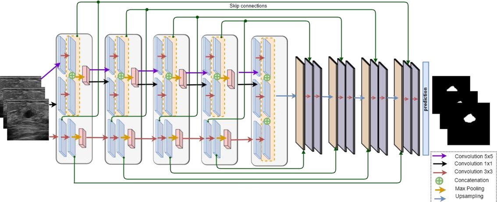

# STAN - Small Tumor-aware Network

Unofficial implementation of [STAN paper](https://arxiv.org/pdf/2002.01034.pdf) published at ISBI 2020 by authors from University of Idaho using Tensorflow 2.0.

     
    <em>STAN architecture</em>

## Dataset

We use the [Dataset B](https://arxiv.org/pdf/1801.03182.pdf) in this implementation. Access permission needed, visit the [Release Requirement](http://www2.docm.mmu.ac.uk/STAFF/m.yap/files/BUS_ReleaseAgreement.pdf) for more details.
